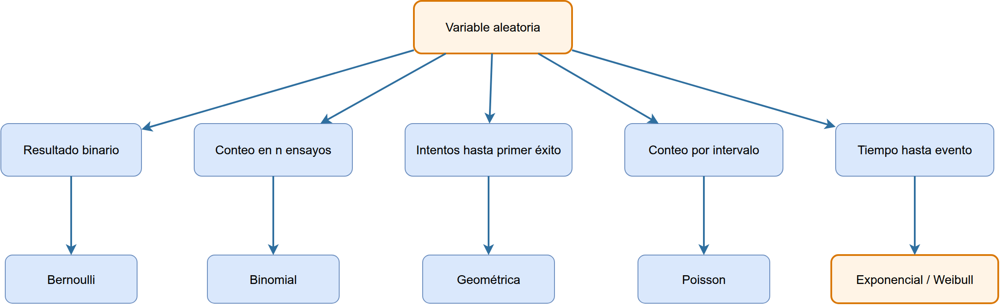

<!-- _class: lead -->

# TEL211
## Disponibilidad y Rendimiento de Sistemas TIC
### Repaso de probabilidad para confiabilidad y rendimiento

Patricio Olivares R.  
Universidad Técnica Federico Santa María

---

## Tópicos de esta presentación

Esta clase repasa distribuciones que se usarán para modelar fallas, reparaciones, conteos y tiempos.

1. Variables aleatorias discretas y continuas.
2. Distribuciones Bernoulli, Binomial y Geométrica.
3. Distribución Poisson para conteos en intervalos.
4. Distribución Exponencial para tiempos con tasa constante.
5. Distribución Weibull para tiempos con riesgo variable.
6. Selección del modelo según la pregunta y sus supuestos.

<div class="bridge">
El objetivo no es memorizar una lista de fórmulas. El objetivo es reconocer qué distribución corresponde a cada situación.
</div>

---

## Propósito: elegir, no memorizar

La tabla muestra ejemplos de situaciones que aparecerán en el ramo y modelos candidatos para cada una.

| Pregunta del sistema | Qué se observa | Modelo candidato |
|---|---|---|
| ¿El paquete llegó? | un resultado sí o no | Bernoulli |
| ¿Cuántos de $n$ módulos funcionan? | conteo acotado | Binomial |
| ¿Cuántos intentos se necesitan hasta lograr éxito? | intentos hasta el primer éxito | Geométrica |
| ¿Cuántas fallas ocurren en $t$? | conteo por intervalo | Poisson |
| ¿Cuánto falta para una falla? | tiempo no negativo | Exponencial o Weibull |

<div class="callout">
La distribución se elige por lo que se observa y por los supuestos que se pueden defender.
</div>

---

## Variables discretas y continuas

Una variable aleatoria traduce un resultado incierto a un número.

| Tipo de variable | Qué valores puede tomar | Ejemplo |
|---|---|---|
| Discreta | valores separados | número de módulos activos |
| Continua | cualquier valor dentro de un rango | tiempo hasta una falla |

Para una variable discreta se suman probabilidades. Para una variable continua se integran densidades.

<div class="bridge">
Esta distinción importa porque cambia la forma de calcular probabilidades.
</div>

---

## Probabilidad discreta y densidad continua

Para una variable discreta:

$$
p_X(x)=P(X=x),
\qquad
\sum_xp_X(x)=1
$$

Para una variable continua:

$$
P(a<T\le b)=\int_a^bf_T(t)\,dt,
\qquad
\int_{-\infty}^{\infty}f_T(t)\,dt=1
$$

En una variable continua $f_T(t)$ es densidad. No se interpreta como $P(T=t)$.

---

## Bernoulli: un ensayo con dos resultados

Se usa cuando hay un solo ensayo con dos resultados posibles: éxito o falla.

Ejemplo simple: lanzar una moneda y definir $X=1$ si sale cara, $X=0$ si no sale cara.

$$
P(X=1)=p,
\qquad
P(X=0)=1-p
$$

La misma función de probabilidad se puede escribir como:

$$
P(X=x)=p^x(1-p)^{1-x},
\qquad x=0,1
$$

Aquí $p$ es la probabilidad de éxito. Si la moneda es equilibrada, $p=0.5$.

$$
E[X]=p,
\qquad
\operatorname{Var}(X)=p(1-p)
$$

Use Bernoulli para modelar un paquete recibido, un enlace operativo o una prueba aprobada.

---

## Binomial: varios ensayos Bernoulli

Se usa cuando se repite el mismo ensayo Bernoulli $n$ veces, con independencia y la misma probabilidad de éxito $p$.

Si $Y$ cuenta cuántos éxitos ocurren:

$$
Y\sim\operatorname{Bin}(n,p)
$$

$$
P(Y=k)=\binom nkp^k(1-p)^{n-k}
$$

- $\binom nk$ cuenta cuántas formas hay de ubicar $k$ éxitos entre $n$ ensayos.
- $p^k$ representa los $k$ éxitos.
- $(1-p)^{n-k}$ representa los $n-k$ fracasos.

---

## Ejemplo breve: Binomial

Se lanza una moneda equilibrada tres veces. Sea $Y$ el número de caras.

La probabilidad de obtener exactamente dos caras es:

$$
P(Y=2)=\binom32(0.5)^2(0.5)^1
$$

$$
P(Y=2)=3(0.25)(0.5)=0.375
$$

En confiabilidad, la misma idea permite contar cuántos componentes funcionan dentro de un conjunto fijo.

---

## Ejemplo adicional: contenedores

Diez contenedores están operativos con probabilidad $p=0.92$, de forma independiente. La plataforma necesita al menos nueve operativos.

Sea $Y$ el número de contenedores operativos:

$$
Y\sim\operatorname{Bin}(10,0.92)
$$

$$
P(Y\ge9)=P(Y=9)+P(Y=10)
$$

$$
P(Y\ge9)=\binom{10}{9}(0.92)^9(0.08)+(0.92)^{10}
\approx0.8121
$$

Si una falla común puede derribar varios contenedores, la independencia deja de ser defendible.

---

## Geométrica: intentos hasta el primer éxito

Se usa cuando se repiten intentos independientes hasta observar el primer éxito.

Si $K$ cuenta el intento donde ocurre el primer éxito:

$$
P(K=k)=(1-p)^{k-1}p,
\qquad k=1,2,\ldots
$$

- $(1-p)^{k-1}$ representa $k-1$ fracasos antes del éxito.
- $p$ representa el éxito en el intento $k$.

$$
E[K]=\frac1p,
\qquad
\operatorname{Var}(K)=\frac{1-p}{p^2}
$$

Se puede usar, por ejemplo, para número de retransmisiones hasta recibir un paquete correctamente.

---

## Ejemplo breve: Geométrica

Un paquete se recibe correctamente con probabilidad $p=0.8$ en cada intento. Los intentos son independientes.

La probabilidad de recibir un paquete correctamente recién en el tercer intento es:

$$
P(K=3)=(1-0.8)^2(0.8)
$$

$$
P(K=3)=(0.2)^2(0.8)=0.032
$$

El número medio de intentos es:

$$
E[K]=\frac1{0.8}=1.25
$$

---

## Poisson: eventos en un intervalo

Se usa para contar eventos que ocurren en un intervalo de tiempo o espacio cuando la tasa puede considerarse constante.

Si $N(t)$ cuenta eventos durante un intervalo de duración $t$:

$$
P\bigl(N(t)=k\bigr)
=\frac{(\nu t)^ke^{-\nu t}}{k!}
$$

- $\nu$ es la tasa media de eventos por unidad de tiempo.
- $\nu t$ es el número medio esperado de eventos en el intervalo.
- $k$ es el conteo observado.

$$
E[N(t)]=\operatorname{Var}(N(t))=\nu t
$$

---

## Ejemplo breve: Poisson

Una red registra en promedio $\nu=2$ fallas por semana.

La probabilidad de observar exactamente tres fallas en una semana es:

$$
P\bigl(N(1)=3\bigr)=\frac{2^3e^{-2}}{3!}
$$

$$
P\bigl(N(1)=3\bigr)\approx0.1804
$$

Use Poisson para conteos de fallas, colisiones o llegadas cuando el intervalo está definido y la tasa es estable.

---

## Exponencial: tiempo hasta el evento

Se usa para modelar el tiempo hasta el próximo evento cuando la tasa de ocurrencia es constante.

Si $T$ es el tiempo hasta la falla:

$$
f_T(t)=\lambda e^{-\lambda t},
\qquad t\ge0
$$

$$
F_T(t)=P(T\le t)=1-e^{-\lambda t}
$$

$$
P(T>t)=e^{-\lambda t}
$$

- $\lambda$ es la tasa de falla.
- $F_T(t)$ es la probabilidad de fallar hasta $t$.
- $P(T>t)$ es la probabilidad de sobrevivir más allá de $t$.

---

## Ejemplo breve: Exponencial

Un equipo tiene tasa de falla $\lambda=0.01\ \mathrm h^{-1}$.

El tiempo medio hasta la falla es:

$$
E[T]=\frac1\lambda=100\ \mathrm h
$$

La probabilidad de sobrevivir más de $150\ \mathrm h$ es:

$$
P(T>150)=e^{-0.01(150)}=e^{-1.5}\approx0.2231
$$

Use Exponencial cuando el riesgo de falla sea aproximadamente constante.

---

## Falta de memoria

La Exponencial satisface:

$$
P(T>s+t\mid T>s)=P(T>t)
$$

Esto significa que haber sobrevivido hasta $s$ no cambia la distribución del tiempo adicional.

Ejemplo: si $\lambda=0.01\ \mathrm h^{-1}$,

$$
P(T>150\mid T>50)=P(T>100)=e^{-1}\approx0.3679
$$

<div class="warn">
La falta de memoria es un supuesto fuerte. No describe componentes cuyo riesgo aumenta por desgaste.
</div>

---

## Weibull: tiempo con riesgo variable

Se usa cuando el riesgo de falla puede cambiar con la edad del componente.

Con forma $\beta$ y escala $\eta$:

$$
R(t)=P(T>t)=e^{-(t/\eta)^\beta}
$$

$$
h(t)=\frac{\beta}{\eta}
\left(\frac{t}{\eta}\right)^{\beta-1}
$$

- $R(t)$ es la probabilidad de sobrevivir más allá de $t$.
- $h(t)$ es el riesgo instantáneo de falla.

---

## Parámetros de Weibull

**Escala $\eta$: vida característica**

- Tiene las mismas unidades que el tiempo, por ejemplo horas o ciclos.
- En $t=\eta$, se cumple $R(\eta)=e^{-1}\approx0.368$.
- Esto significa que cerca del $63.2\%$ de los componentes ha fallado antes de $\eta$.

**Forma $\beta$: concentración de las fallas**

- Valores bajos representan fallas más dispersas en el tiempo.
- Valores altos concentran las fallas en un intervalo más cercano a $\eta$.

---

## Interpretación de Weibull

| Forma | Riesgo | Cuándo puede aparecer |
|---:|---|---|
| $0<\beta<1$ | decreciente | fallas tempranas |
| $\beta=1$ | constante | caso exponencial |
| $\beta>1$ | creciente | desgaste |

---

## Interpretación de Weibull

Ejemplo: una fuente de poder muestra desgaste, por lo que el riesgo de falla aumenta con la edad. Se modela con $\beta=2$ y escala $\eta=1000\ \mathrm h$.

Aquí $1000\ \mathrm h$ no es una garantía. Es la vida característica: al llegar a $t=\eta$, el modelo deja cerca de $36.8\%$ de supervivencia y cerca de $63.2\%$ de fallas acumuladas.

¿Cuál es la probabilidad de que siga funcionando después de $500\ \mathrm h$?

$$
R(500)=e^{-(500/1000)^2}=e^{-0.25}\approx0.7788
$$

El resultado indica cerca de $77.9\%$ de probabilidad de sobrevivir más de $500\ \mathrm h$ bajo ese modelo.

Use Weibull cuando exista evidencia de fallas tempranas o desgaste.

---

## Mapa de selección

| Pregunta que se quiere responder | Distribución |
|---|---|
| ¿El evento ocurre o no ocurre en un solo ensayo? | Bernoulli |
| ¿Cuántos éxitos aparecen en $n$ ensayos independientes? | Binomial |
| ¿Cuántos intentos se necesitan hasta el primer éxito? | Geométrica |
| ¿Cuántos eventos ocurren en un intervalo de tiempo o espacio? | Poisson |
| ¿Cuánto tiempo falta hasta una falla con tasa constante? | Exponencial |
| ¿Cuánto tiempo falta hasta una falla cuando el riesgo cambia con la edad? | Weibull |

<div class="bridge">
La pregunta orienta la distribución. El supuesto principal confirma si esa elección es válida.
</div>

---

## Mapa visual de selección



---

## Ejercicio

1. Diez enlaces funcionan de forma independiente con $p=0.9$. Calcule la probabilidad de que al menos ocho funcionen.
2. Un paquete se recibe correctamente con probabilidad $p=0.8$. Calcule la probabilidad de lograrlo recién en el tercer intento.
3. Ocurren cinco colisiones por hora. Calcule la probabilidad de observar exactamente dos en $30\ \mathrm{min}$.
4. Un router tiene vida exponencial con $\lambda=0.01\ \mathrm h^{-1}$. Calcule $P(T>150\ \mathrm h)$.

Antes de calcular, indique variable, distribución, parámetros y supuesto principal.

---

## Solución: Binomial y Geométrica

Para enlaces:

$$
P(Y\ge8)=\sum_{k=8}^{10}\binom{10}{k}
(0.9)^k(0.1)^{10-k}
\approx0.9298
$$

Para el paquete:

$$
P(K=3)=(1-0.8)^2(0.8)=0.032
$$

En ambos casos se requiere independencia entre ensayos.

---

## Solución: Poisson

Para colisiones, el intervalo es $0.5\ \mathrm h$:

$$
\nu t=(5\ \mathrm h^{-1})(0.5\ \mathrm h)=2.5
$$

$$
P\bigl(N(0.5)=2\bigr)
=\frac{2.5^2e^{-2.5}}{2!}
\approx0.2565
$$

El producto $\nu t$ no tiene unidades y representa el conteo medio esperado.

---

## Solución: tiempo de vida

Para el router:

$$
P(T>150)=e^{-\lambda t}=e^{-1.5}\approx0.2231
$$

Comprobaciones:

- $\lambda t$ es adimensional.
- El resultado está en $[0,1]$.
- Como $E[T]=100\ \mathrm h$, sobrevivir $150\ \mathrm h$ debe ser menos probable que sobrevivir la media.

---

## Ejemplo ejecutable

El notebook `codigo/distribuciones.ipynb` reproduce los cálculos anteriores y permite visualizar cada distribución.

```bash
jupyter notebook codigo/distribuciones.ipynb
```

El notebook se usa para explorar sensibilidad. La selección del modelo y sus supuestos siguen siendo parte de la solución.

---

## Resumen

- Bernoulli modela un resultado sí o no.
- Binomial modela cuántos componentes cumplen una condición.
- Geométrica modela intentos hasta el primer éxito.
- Poisson modela cuántos eventos ocurren en un intervalo.
- Exponencial y Weibull modelan cuándo ocurre una falla.

La siguiente clase transforma el tiempo aleatorio $T$ en confiabilidad, riesgo y vida media.

---

## Referencias

- K. S. Trivedi y A. Bobbio, *Reliability and Availability Engineering: Modeling, Analysis, and Applications*, Cambridge University Press, 2017, secs. 3.1-3.3.
- K. S. Trivedi, *Probability and Statistics with Reliability, Queuing, and Computer Science Applications*, 2.ª ed., Wiley, 2002, caps. 2-3.
- Controles de distribuciones TEL211 de L. A. Lizama, material histórico USM.
