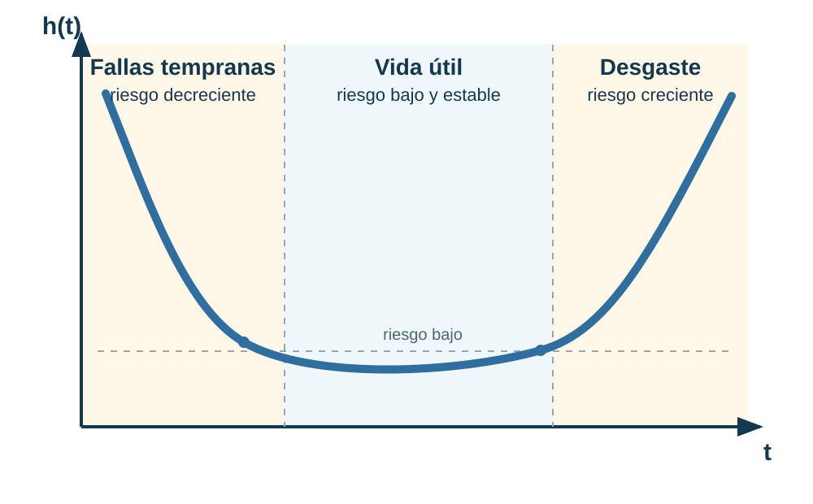
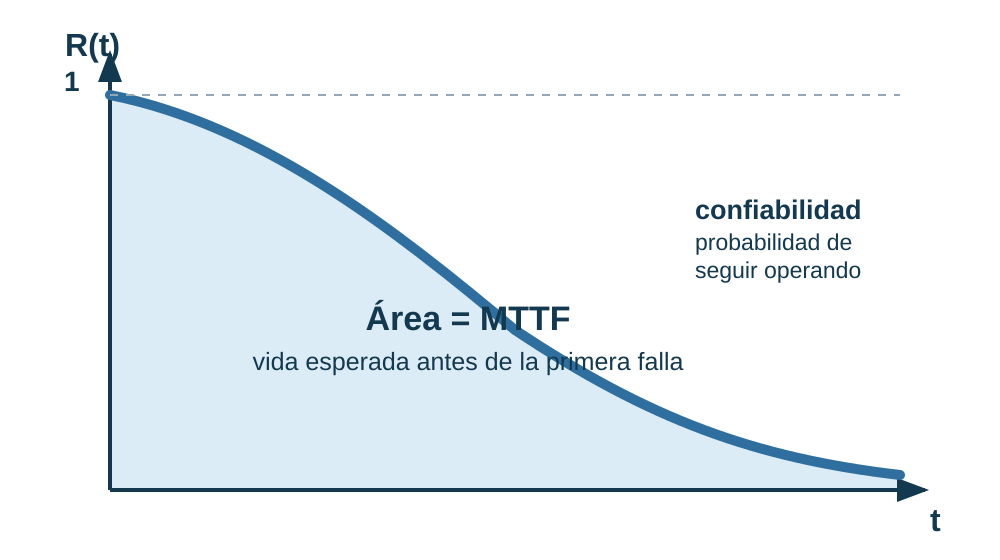
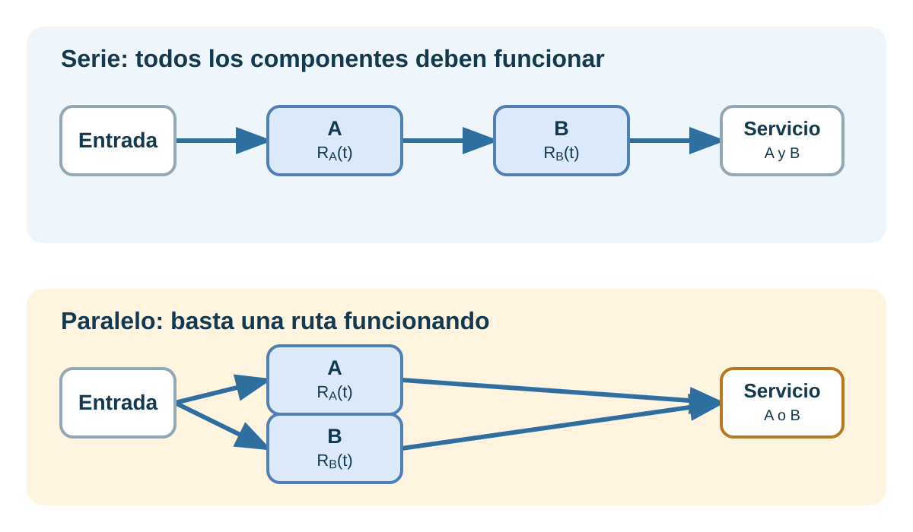

<!-- _class: lead -->

# TEL211
## Disponibilidad y Rendimiento de Sistemas TIC
### Teoría de confiabilidad: del tiempo de vida a una decisión

Patricio Olivares R.  
Universidad Técnica Federico Santa María

---

## Propósito y punto de partida

La clase anterior entregó distribuciones para conteos y tiempos. Ahora se usará una variable:

$$
T=\text{tiempo hasta que el componente deja de cumplir su funci\'on}
$$

Al finalizar podrá:

- definir el evento de falla y la misión
- relacionar $F(t)$, $f(t)$, $R(t)$ y $h(t)$
- calcular confiabilidad y vida media
- elegir entre modelos exponencial y Weibull
- interpretar el resultado sin confundirlo con disponibilidad.

---

## Antes de calcular: ¿qué significa "falla"?

Para el desarrollo de una API crítica, una falla podría ser:

- no responder
- superar $200\ \mathrm{ms}$ de latencia
- responder con datos incorrectos
- perder más de $10^{-4}$ de las solicitudes.

Una afirmación de confiabilidad debe declarar:

$$
\boxed{\text{funci\'on}+\text{condiciones}+\text{horizonte temporal}}
$$

"El servidor es 99.9% confiable" es una declaración incompleta si no se define el evento y el tiempo de misión.

---

## Cuatro funciones, una misma variable

Sea $T\ge 0$ una variable aleatoria continua, que representa el tiempo hasta la falla.

| Pregunta | Función | Qué entrega |
|---|---|---|
| ¿Qué probabilidad hay de fallar antes de $t$? | $F(t)=P(T\le t)$ | falla acumulada |
| ¿Qué probabilidad hay de completar una misión de duración $t$? | $R(t)=P(T>t)$ | confiabilidad |
| ¿En qué tiempos se concentran las fallas? | $f(t)=\dfrac{dF(t)}{dt}$ | forma de la distribución |
| ¿Cómo cambia el riesgo para quienes ya sobrevivieron hasta $t$? | $h(t)=\dfrac{f(t)}{R(t)}$ | tasa condicional de falla |

Estas funciones son formas de responder preguntas distintas sobre el mismo tiempo de vida.

Para una misión se suele reportar R(t). Las otras funciones ayudan a obtenerla, interpretarla y decidir si el modelo usado tiene sentido.

---

## Falla acumulada y confiabilidad

$F(t)$ obtiene la probabilidad de que la falla ya haya ocurrido hasta el tiempo $t$.

$R(t)$ obtiene el evento complementario: sobrevivir más allá de $t$.

$$
R(t)=1-F(t)
$$

Para una misión de duración $t$, $R(t)$ es la probabilidad de completar la misión sin fallar.

La misma variable T produce dos lecturas complementarias: falla acumulada y supervivencia.

---

## Densidad: dónde se ubican las fallas

La densidad muestra cómo se reparte la probabilidad de falla sobre el tiempo.

Si $F(t)$ acumula probabilidad de falla, $f(t)$ mide cómo crece esa acumulación alrededor de $t$.

$$
f(t)=\frac{dF(t)}{dt}=-\frac{dR(t)}{dt}
$$

La probabilidad en un intervalo se obtiene como área bajo la densidad.

---

## Confiabilidad como área restante

La confiabilidad también se puede leer desde la densidad:

$$
R(t)=\int_t^\infty f(u)\,du
$$

El área a la derecha de $t$ reúne todos los tiempos de falla mayores que $t$.

Por eso R(t) responde si el componente sobrevive más allá del tiempo de misión.

---

## Riesgo condicional: evento y condición

$R(t)$ entrega la supervivencia desde el inicio.

Para medir el riesgo después de $t$, se condiciona a que el componente llegó funcionando hasta ese tiempo.

| Elemento | Significado |
|---|---|
| $T>t$ | el componente sobrevivió hasta $t$ |
| $t<T\le t+\Delta t$ | falla dentro del intervalo siguiente |

---

## Riesgo condicional: evento y condición

El evento de falla en el intervalo se obtiene como caída de supervivencia:

$$
P(t<T\le t+\Delta t)=R(t)-R(t+\Delta t)
$$

Por probabilidad condicional:

$$
P(A\mid B)=\frac{P(A\cap B)}{P(B)}
$$

con $A=\{t<T\le t+\Delta t\}$ y $B=\{T>t\}$:

$$
P(t<T\le t+\Delta t\mid T>t)
=\frac{R(t)-R(t+\Delta t)}{R(t)}
$$

---

## Riesgo condicional en un intervalo pequeño

La probabilidad anterior depende del tamaño del intervalo $\Delta t$.

Para convertirla en una intensidad local, se divide por la duración del intervalo:

$$
\frac{P(t<T\le t+\Delta t\mid T>t)}{\Delta t}
=\frac{R(t)-R(t+\Delta t)}{R(t)\Delta t}
$$

Al hacer el intervalo cada vez más pequeño:

$$
\lim_{\Delta t\to 0}
\frac{R(t)-R(t+\Delta t)}{\Delta t}
=-R'(t)=f(t)
$$

Por eso:

$$
h(t)=\frac{f(t)}{R(t)}
$$

---

## Del riesgo a la confiabilidad

**Idea central:** si conocemos cómo evoluciona $h(t)$, podemos reconstruir $R(t)$.

Partimos de:

$$
h(t)=\frac{f(t)}{R(t)}
$$

Como $f(t)=-R'(t)$:

$$
h(t)=-\frac{R'(t)}{R(t)}
=-\frac{d}{dt}\ln R(t)
$$

El logaritmo aparece porque:

$$
\frac{d}{dt}\ln R(t)=\frac{R'(t)}{R(t)}
$$

---

## Del riesgo a la confiabilidad

Integrando desde $0$ hasta $t$:

$$
\int_0^t h(u)\,du
=-\left[\ln R(t)-\ln R(0)\right]
$$

Como al inicio el componente funciona, $R(0)=1$ y $\ln R(0)=0$. Definimos:

$$
H(t)=\int_0^t h(u)\,du
\qquad\Longrightarrow\qquad
\boxed{R(t)=e^{-H(t)}}
$$

---

## Del riesgo a la confiabilidad

$$
\boxed{
h(t)
\quad\xrightarrow{\text{integrar}}\quad
H(t)
\quad\xrightarrow{\,e^{-H(t)}\,}\quad
R(t)
}
$$

h(t) representa el riesgo de falla en cada instante. 
H(t) es el riesgo acumulado desde el inicio. 
R(t) indica la probabilidad de seguir funcionando después de acumular ese riesgo.

---

## Caso de riesgo constante

La hipótesis más simple es que el riesgo no cambia con el tiempo:

$$
h(t)=\lambda
$$

$$
H(t)=\int_0^t\lambda\,du=\lambda t
$$

$$
\boxed{
h(t)=\lambda
\quad\xrightarrow{\text{integrar}}\quad
H(t)=\lambda t
\quad\xrightarrow{\,e^{-H(t)}\,}\quad
R(t)=e^{-\lambda t}
}
$$

La distribución <strong>Exponencial</strong> aparece cuando suponemos que la tasa de falla es constante.

Si $h(t)$ cambia con el tiempo, la misma relación permite obtener otros modelos, como Weibull.

---

## Ejemplo guiado: misión de un router

Un router tiene tasa de falla constante
$\lambda=2\times10^{-5}\ \mathrm h^{-1}$.

Para una misión de un año, $t=8760\ \mathrm h$:

$$
R(8760)=e^{-(2\times10^{-5})(8760)}
=e^{-0.1752}\approx 0.8393
$$

Por tanto:

$$
P(T\le8760)=1-R(8760)\approx0.1607
$$

El resultado se refiere a un router **sin reparación durante la misión**.

---

## La exponencial y la falta de memoria

Si $T$ es exponencial:

$$
P(T>s+t\mid T>s)=P(T>t)=e^{-\lambda t}
$$

Ejemplo: si el router anterior ya sobrevivió $5000\ \mathrm h$, la probabilidad de sobrevivir otras $1000\ \mathrm h$ es:

$$
P(T>6000\mid T>5000)=e^{-0.02}\approx0.9802
$$

La igualdad proviene del modelo, no de que los equipos reales "rejuvenezcan". Debe justificarse con el mecanismo y los datos.

---

## Modelo Weibull: riesgo variable

Con forma $\beta>0$ y escala $\eta>0$:

$$
R(t)=e^{-(t/\eta)^\beta}
$$

$$
f(t)=\frac{\beta}{\eta}\left(\frac{t}{\eta}\right)^{\beta-1}
e^{-(t/\eta)^\beta}
$$

$$
h(t)=\frac{\beta}{\eta}\left(\frac{t}{\eta}\right)^{\beta-1}
$$

Cuando $\beta=1$, Weibull se reduce a una Exponencial con $\lambda=1/\eta$.

---

## Curva de bañera: elegir según el mecanismo

| Weibull | Comportamiento de h(t) | Lectura |
|---|---|---|
| 0 < β < 1 | decreciente | fallas tempranas |
| β = 1 | aproximadamente constante | caso exponencial |
| β > 1 | creciente | desgaste |

La distribución se elige por el mecanismo de falla y la evidencia disponible, no por comodidad algebraica.

La curva de bañera es una composición conceptual de mecanismos. Una sola Weibull representa una tendencia y no necesariamente las tres fases a la vez.

---

## Ejemplo Weibull: batería

La vida de una batería sigue un modelo Weibull con $\beta=2$ y $\eta=5\ \text{a\~nos}$.

**Confiabilidad a $3\ \text{a\~nos}$:**

$$
R(3)=e^{-(3/5)^2}\approx0.6977
$$

**Riesgo instantáneo a $3\ \text{a\~nos}$:**

$$
h(3)=\frac{2}{5}\left(\frac{3}{5}\right)
=0.24\ \text{a\~no}^{-1}
$$

El riesgo aumenta con la edad porque $\beta>1$.

---

## Tiempo medio hasta la falla (MTTF)

MTTF proviene de *Mean Time To Failure*: la vida media esperada antes de la **primera falla** de una unidad no reparable.

$$
\mathrm{MTTF}=E[T]
=\int_0^\infty t\,f(t)\,dt
=\int_0^\infty R(t)\,dt
$$

La primera forma promedia los tiempos de falla usando $f(t)$. Como $f(t)=-R'(t)$, una integración por partes la transforma en el área bajo $R(t)$.

---

## Tiempo medio hasta la falla (MTTF)

| Modelo | MTTF |
|---|---|
| Exponencial | $\dfrac{1}{\lambda}$ |
| Weibull | $\eta\,\Gamma\!\left(1+\dfrac{1}{\beta}\right)$ |

$\Gamma(\cdot)$ es la función Gamma. Extiende el factorial a valores no enteros. Para $n=1,2,\ldots$, $\Gamma(n)=(n-1)!$. En Weibull incorpora el efecto de la forma $\beta$ sobre la vida media.

MTTF es un <strong>promedio de muchas unidades</strong>, no una garantía ni un tiempo de misión. Para responder si una misión se completa, se usa R(t).

Para el router anterior, $\lambda=2\times10^{-5}\ \mathrm h^{-1}$ implica $\mathrm{MTTF}=50\,000\ \mathrm h$. Sin embargo, $R(50\,000)=e^{-1}\approx0.368$.

---

## MTTF: el área bajo la confiabilidad

En cada intervalo pequeño de tiempo, la confiabilidad representa la fracción esperada de unidades que sigue funcionando.

La suma de esas contribuciones forma el área sombreada del diagrama.

h(t) define R(t). El área bajo R(t) entrega la vida media.

---

## MTTF: el área bajo la confiabilidad

En un intervalo pequeño de duración $dt$:

$$
R(t)\,dt
$$

Al sumar todos los intervalos:

$$
\boxed{\mathrm{MTTF}=\int_0^\infty R(t)\,dt}
$$

---

## Confiabilidad no es disponibilidad

| Métrica | Pregunta que responde | ¿La reparación importa? |
|---|---|---|
| $R(t)$ | ¿completa la misión sin fallar? | no durante la misión |
| $A(t)$ | ¿está operativo en el instante $t$? | sí |
| $A_\infty$ | ¿qué fracción de largo plazo opera? | sí |

---

## Confiabilidad no es disponibilidad

Ejemplo: una API se detiene $10\ \mathrm{min}$ y se recupera automáticamente durante un mes de $720\ \mathrm h$:

$$
A_{\mathrm{obs}}=\frac{720-1/6}{720}\approx0.9998
$$

Su disponibilidad observada es cercana a $99.98\%$, pero **no completó** una misión de un mes sin interrupciones.

Una <strong>CMTC</strong> (cadena de Markov en tiempo continuo, <em>CTMC</em> en inglés) representa transiciones aleatorias entre estados como operativo y en reparación. Se usará para incorporar reparación de manera explícita. No debe introducirse dentro de R(t) sin redefinir la misión.

---

## De datos de falla a confiabilidad

Para calcular $R(t)$ en una misión, primero se debe estimar la tasa de falla a partir de una flota o prueba comparable.

Sea:

| Dato | Significado |
|---|---|
| $d$ | número de fallas observadas |
| $\tau$ | tiempo total observado de funcionamiento |

Si el riesgo es aproximadamente constante:

$$
\widehat{\lambda}=\frac{d}{\tau}
$$

El sombrero indica que el parámetro proviene de datos: es una estimación, no una certeza.

---

## De una tasa estimada a una decisión

Bajo el modelo exponencial, los mismos datos permiten estimar la vida media y la confiabilidad de una misión:

$$
\boxed{
\widehat{\lambda}=\frac{d}{\tau}
\quad\Longrightarrow\quad
\widehat{\mathrm{MTTF}}=\frac{1}{\widehat{\lambda}}=\frac{\tau}{d}
\quad\Longrightarrow\quad
\widehat{R}(t)=e^{-\widehat{\lambda}t}
}
$$

Los datos no solo resumen fallas pasadas. También permiten estimar la probabilidad de completar una misión futura.

---

## Ejemplo: prueba de módulos con censura

Se observan cinco módulos de alimentación de routers:

| Módulo | Resultado al cierre | Tiempo observado |
|---|---|---:|
| A | falló | $800\ \mathrm h$ |
| B | falló | $1000\ \mathrm h$ |
| C | falló | $1200\ \mathrm h$ |
| D | seguía operando | $1000\ \mathrm h$ |
| E | seguía operando | $1000\ \mathrm h$ |

Hay $d=3$ fallas y $\tau=5000\ \mathrm h$ de exposición total:

$$
\widehat{\lambda}=\frac{3}{5000}=6\times10^{-4}\ \mathrm h^{-1},
\qquad
\widehat{\mathrm{MTTF}}\approx1667\ \mathrm h
$$

Para una misión de $500\ \mathrm h$:

$$
\widehat{R}(500)=e^{-(6\times10^{-4})(500)}\approx0.7408
$$

---

## Antes de estimar: condiciones y cautelas

Antes de usar $\widehat{R}(t)$ para decidir, pregunte:

- ¿Los componentes y sus condiciones de operación son comparables?
- ¿La tasa de falla es aproximadamente constante en la ventana de interés?
- ¿El tiempo total $\tau$ incorpora todas las unidades observadas?
- ¿La misión y el evento de falla están definidos antes de calcular $R(t)$?

Las unidades que siguen funcionando al cierre aportan tiempo a $\tau$: son **datos censurados**, no datos que se deban descartar.

$$
\widehat{\lambda}
=
\frac{\text{fallas observadas}}
{\text{tiempo total observado de todas las unidades}}
$$

Estimar una tasa no demuestra que la Exponencial sea apropiada. Si el riesgo cambia con la edad, debe evaluarse un modelo como Weibull.

---

## Ejemplo integrado: misión de un módulo

Un módulo de alimentación tiene vida exponencial con $\mathrm{MTTF}=4000\ \mathrm h$. Durante una actualización de $1500\ \mathrm h$ no habrá reemplazo ni reparación.

El equipo de operación necesita responder:

1. ¿Cuál es la tasa de falla asumida?
2. ¿Qué probabilidad hay de completar las primeras $1000\ \mathrm h$?
3. ¿Qué probabilidad hay de fallar entre $1000$ y $1500\ \mathrm h$?
4. Si ya sobrevivió $1000\ \mathrm h$, ¿qué probabilidad tiene de completar las $500\ \mathrm h$ restantes?

---

## Solución

1. **Tasa de falla asumida**

    $$
    \lambda=\frac{1}{4000}=2.5\times10^{-4}\ \mathrm h^{-1}
    $$

---

## Solución

2. **Probabilidad de completar las primeras $1000\ \mathrm h$**

    $$
    R(1000)=e^{-1000/4000}=e^{-0.25}\approx0.7788
    $$

    La misión de $1000\ \mathrm h$ se completa en aproximadamente $779$ de cada $1000$ módulos equivalentes bajo este modelo.

---

## Solución

3. **Probabilidad de fallar entre $1000$ y $1500\ \mathrm h$**

    Antes de condicionar, se consideran todos los módulos que partieron al inicio:

    $$
    \begin{aligned}
    P(1000<T\le1500)
    &=F(1500)-F(1000)\\
    &=R(1000)-R(1500)\\
    &=e^{-0.25}-e^{-0.375}\\
    &\approx0.0915
    \end{aligned}
    $$

    Esta es la probabilidad de fallar en ese intervalo entre todos los módulos que comenzaron la misión.

---

## Solución

4. **Probabilidad condicional de completar las $500\ \mathrm h$ restantes**

    Recordar que $P(A\mid B)=P(A\cap B)/P(B)$.

    $$
    \begin{aligned}
    P(T>1500\mid T>1000)
    &=\frac{P(T>1500)}{P(T>1000)}\\
    &=\frac{e^{-1500/4000}}{e^{-1000/4000}}\\
    &=e^{-500/4000}\\
    &\approx0.8825
    \end{aligned}
    $$

    

    0.0915 es una probabilidad desde el inicio. 0.8825 es la probabilidad de completar 500 horas adicionales <strong>entre los supervivientes a 1000 horas</strong>. La simplificación depende de la falta de memoria Exponencial.
    

---

## Checklist para interpretar un resultado

| Antes de reportar | Comprobación |
|---|---|
| Evento y misión | ¿Qué significa falla y cuánto dura $t$? |
| Modelo | ¿$h(t)$ es aproximadamente constante o cambia con la edad? |
| Probabilidad | $R(t)=P(T>t)$ y $F(t)=1-R(t)$ responden preguntas complementarias |
| Unidades | Si $\lambda$ está en $\mathrm h^{-1}$, entonces $\lambda t$ no tiene unidades |
| Vida media | MTTF es un promedio, no una garantía de duración |
| Reparación | Si hay recuperación, ¿corresponde $R(t)$ o disponibilidad? |

---

## De un componente a un servicio

Hasta ahora se modeló un componente. Para obtener $R_{\mathrm{sistema}}(t)$ también se necesita saber cómo se conectan los componentes.

---

## Misma confiabilidad, diseños distintos

Si dos componentes independientes tienen $R_1(t)=R_2(t)=0.9$:

$$
\begin{aligned}
R_{\mathrm{serie}}(t)&=0.9\times0.9=0.81,\\
R_{\mathrm{paralelo}}(t)&=1-(1-0.9)^2=0.99.
\end{aligned}
$$

La misma confiabilidad individual puede producir servicios muy distintos. La siguiente clase generaliza este cálculo a arquitecturas serie, paralelo y $k$-de-$n$.

---

## Cierre: una ruta para analizar confiabilidad

1. Defina la falla y el tiempo de misión.
2. Describa el riesgo $h(t)$ y elija un modelo defendible: Exponencial o Weibull.
3. Obtenga $R(t)$ para responder si la misión se completa y use el área bajo $R(t)$ para interpretar MTTF.
4. No confunda una misión sin fallas con disponibilidad de un servicio reparable.
5. Para un servicio, combine las confiabilidades según su arquitectura.

---

## Referencias

- K. S. Trivedi y A. Bobbio, *Reliability and Availability Engineering: Modeling, Analysis, and Applications*, Cambridge University Press, 2017, caps. 1-3.
- K. S. Trivedi, *Probability and Statistics with Reliability, Queuing, and Computer Science Applications*, 2.ª ed., Wiley, 2002, caps. 3-4.
- J. M. Martínez, *TEL211: Reliability as a Function of Time* y *Expectation*, material histórico USM.
