<!-- _class: lead -->

# TEL211
## Disponibilidad y Rendimiento de Sistemas TIC
### Diagramas de bloques de confiabilidad (RBD)

Patricio Olivares R.  
Universidad Técnica Federico Santa María

---

## Propósito de la clase

Partir de las confiabilidades temporales $R_i(t)$ de los componentes y transformarlas en la confiabilidad de una arquitectura completa mediante un **diagrama de bloques de confiabilidad** (RBD, *Reliability Block Diagram*).

<div class="callout">
La distribución de cada componente responde "¿sobrevive la misión?". El RBD agrega "¿qué combinación de componentes permite que el sistema cumpla su función?".
</div>

---

## Ruta

En esta clase pasaremos de la confiabilidad de un componente a la de un sistema, primero con estructuras reducibles y luego con redes más generales:

1. **Motivación:** ¿Por qué necesitamos modelar sistemas complejos?
2. **Concepto de RBD:** Bloques, conexiones y significado
3. **Configuración serie:** Confiabilidad del sistema
4. **Configuración paralelo:** Redundancia y mejora
5. **Dependencias estructurales:** límites de la redundancia
6. **Sistemas $k$ de $n$ y redundancia modular triple (TMR):** redundancia con mayoría
7. **Sistemas no reducibles:** condicionamiento y conjuntos mínimos

---

## ¿Qué es un Diagrama de Confiabilidad?

Un **RBD** es una representación gráfica donde:

- Cada **bloque** representa un componente o subsistema del sistema
- El **estado del bloque** (funcionando/fallado) afecta el sistema
- La **conexión entre bloques** define la lógica de funcionamiento, no necesariamente la conexión física

El sistema funciona si existe un camino de bloques operativos entre la entrada y la salida. Por eso, un RBD representa la **estructura lógica** de éxito o falla del sistema. Los modelos temporales vistos anteriormente entregan $R_i(t)$ para cada componente, por ejemplo mediante Exponencial o Weibull.

<div class="bridge">
El RBD combina esas confiabilidades según la arquitectura del sistema.
</div>

---

## Elementos Básicos de un RBD

### Componentes

Cada bloque representa el evento $E_i=$ "el componente $i$ cumple su función durante la misión". Su probabilidad es la confiabilidad temporal que se obtuvo en la unidad anterior:

$$
P(E_i)=R_i(t)
$$

Las reglas de producto y complemento que siguen suponen independencia entre los eventos $E_i$.

---

## Elementos Básicos de un RBD

<div class="columns">
<div class="warn">
<strong>Dependencia</strong>
<p>Las ramas paralelas representan alternativas lógicas, pero no garantizan independencia. Las fallas de causa común requieren un modelo adicional.</p>
</div>

<div class="example-space">
<strong>Ejemplo TIC</strong>
<p>Dos servidores pueden compartir un switch, alimentación o almacenamiento. Si falla el recurso común, ambas ramas fallan y el paralelo sobreestima la confiabilidad.</p>
</div>
</div>

---

## Elementos Básicos de un RBD

### Conexiones:
- **Serie:** Todos deben funcionar
- **Paralelo:** Al menos uno debe funcionar
- **Mixto:** Combinación de ambas

---

## Ejemplo de RBD: switch y servidores redundantes

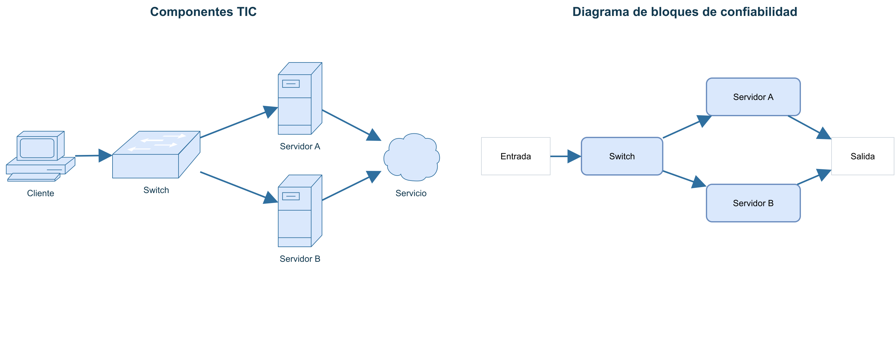

<div class="small">
El sistema real muestra componentes y conexiones. El RBD abstrae esos detalles y conserva la lógica de funcionamiento: debe existir un camino operativo entre entrada y salida.
</div>

---

## Configuración en Serie

**Regla:** El sistema funciona si y solo si **todos** los componentes funcionan.

El evento de éxito es la intersección de los eventos de funcionamiento. Bajo independencia, la probabilidad de esa intersección se obtiene multiplicando las confiabilidades individuales.

### Cálculo:

$$
R_{\mathrm{sistema}}(t)=R_1(t)R_2(t)\cdots R_n(t)=\prod_i R_i(t)
$$

<div class="callout">
Cada componente obligatorio agrega una oportunidad de falla. Por eso, la confiabilidad del sistema serie no es mayor que la del componente menos confiable.
</div>

---

## Configuración en Serie: Ejemplo

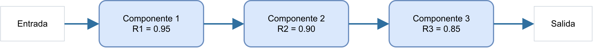

<div class="small">
Las tres funciones son obligatorias. El sistema funciona solo si el camino completo permanece operativo.
</div>

---

## Configuración en Serie: Ejemplo

Tres componentes con confiabilidades:
- $R_1=0.95$
- $R_2=0.90$  
- $R_3=0.85$

**Cálculo:**

$$
R_{\mathrm{sistema}}=0.95\times0.90\times0.85=0.72675\approx72.7\%
$$

<div class="warn">
Aún con componentes de alta confiabilidad, el sistema en serie puede tener confiabilidad significativamente menor.
</div>

El resultado muestra el efecto acumulativo: la misión sólo se completa si los tres componentes sobreviven.

---

## Paralelo: partir desde $R_i(t)$ y $F_i(t)$

Cada componente tiene confiabilidad $R_i(t)$. Su probabilidad de fallar antes de $t$ es:

$$
F_i(t)=1-R_i(t)
$$

En un sistema en paralelo, el sistema funciona mientras **al menos una rama siga funcionando**. Por lo tanto, el sistema falla solamente si **todas las ramas fallan**.

<div class="bridge">
La distribución describe cada componente. El RBD combina esas probabilidades según la lógica de funcionamiento del sistema.
</div>

---

## Paralelo: dos componentes independientes

Para dos componentes, el único caso de falla del sistema es que fallen ambos:

$$
F_{\mathrm{s}}(t)=F_1(t)F_2(t)
$$

Por complemento, la confiabilidad del sistema es:

$$
R_{\mathrm{s}}(t)=1-F_1(t)F_2(t)
$$

Sustituyendo $F_i(t)=1-R_i(t)$:

$$
R_{\mathrm{s}}(t)=1-[1-R_1(t)][1-R_2(t)]
$$

---

## Paralelo: generalización a $n$ componentes

El mismo razonamiento se extiende a todas las ramas:

$$
R_{\mathrm{s}}(t)=1-\prod_{i=1}^{n}[1-R_i(t)]
$$

<div class="callout">
En paralelo no calculamos directamente el éxito: primero calculamos el único caso que hace fallar al sistema, que fallen todas las ramas.
</div>

$$
R(t)\quad\longrightarrow\quad F(t)=1-R(t)\quad\longrightarrow\quad \text{arquitectura RBD}\quad\longrightarrow\quad R_{\mathrm{s}}(t)
$$

---

## Configuración en Paralelo: la lógica de las ramas

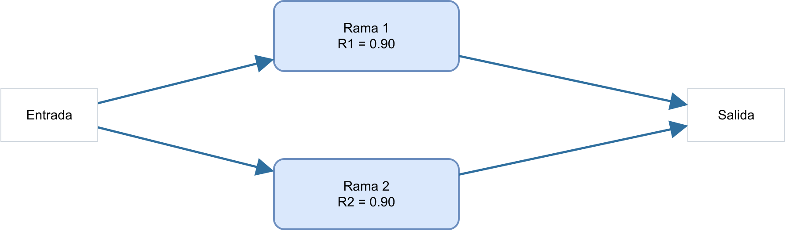

<div class="small">
Las dos ramas están activas y cualquiera puede sostener la salida. La misión falla solo si fallan ambas.
</div>

---

## Configuración en Paralelo: ejemplo numérico

Dos componentes idénticos con $R=0.90$:

**Cálculo:**

$$
R_{\mathrm{sistema}}=1-(1-0.90)(1-0.90)=1-0.10\times0.10=0.99=99\%
$$

<div class="callout">
Cada componente falla con probabilidad 10%. El sistema falla solo si ambos fallan, lo que ocurre con probabilidad 1%.
</div>

---

## Paralelo: por qué la redundancia mejora $R_{\mathrm{s}}(t)$

Una falla individual ya no termina la misión: la otra rama puede continuar sosteniendo la función del sistema.

<div class="bridge">
Este cálculo representa redundancia <strong>activa</strong>: las ramas operan simultáneamente y sus fallas se modelan como independientes.
</div>

---

## Comparación Serie vs Paralelo

| Configuración | Confiabilidad | Uso típico |
|---|---|---|
| **Serie** | No mayor que el componente menos confiable | Cadena obligatoria de funciones |
| **Paralelo** | No menor que cada rama | Redundancia crítica |

**Intuición:** en serie se acumulan puntos únicos de falla. En paralelo se requiere que fallen todas las ramas para perder la función.

<div class="bridge">
La comparación separa dos decisiones de diseño: eliminar puntos obligatorios de falla o agregar alternativas para una función crítica.
</div>

---

## Dependencia estructural: límites de la redundancia

Dos servidores pueden estar conectados en paralelo y, aun así, compartir un switch, una fuente de alimentación o un sistema de almacenamiento:

```text
Servidor A ──┐
             ├── Recurso común ── Salida
Servidor B ──┘
```

Si falla el recurso común, las dos ramas quedan fuera de servicio simultáneamente. Por lo tanto, las ramas no son independientes y la redundancia aparente sobreestima la confiabilidad.

<div class="warn">
El cálculo de paralelo sólo es válido si el recurso común se incluye como bloque propio o si sus fallas se modelan explícitamente.
</div>

---

## Redundancia de sistema y de componentes

Replicar el sistema completo y replicar cada componente por separado no son la misma decisión de diseño:

- **Redundancia de sistema:** se duplican trayectorias completas y luego se conectan en paralelo.
- **Redundancia de componentes:** se agregan alternativas dentro de cada función obligatoria.

Las dos estrategias producen RBD distintos. Además, los recursos compartidos, como switches, fuentes o almacenamiento, pueden convertirse en puntos únicos de falla y reducir el beneficio esperado.

<div class="bridge">
Antes de comparar alternativas, identifique qué función se está duplicando y qué elementos siguen siendo obligatorios para todas las trayectorias.
</div>

---

## Sistemas Mixtos

### Ejemplo: serie y paralelo

El componente $1$ es obligatorio y luego existen tres alternativas redundantes $2a$, $2b$ y $2c.$

La estrategia es reducir primero el bloque interno más simple y usar su resultado como un único bloque dentro de la estructura restante.

**Pasos de cálculo:**

1. Calcular paralelismo: $R_{\mathrm{paralelo}}=1-(1-R_{2a})(1-R_{2b})(1-R_{2c})$
2. Calcular serie total: $R_{\mathrm{sistema}}=R_1R_{\mathrm{paralelo}}$

---

## Sistemas Mixtos

### Ejemplo: serie y paralelo

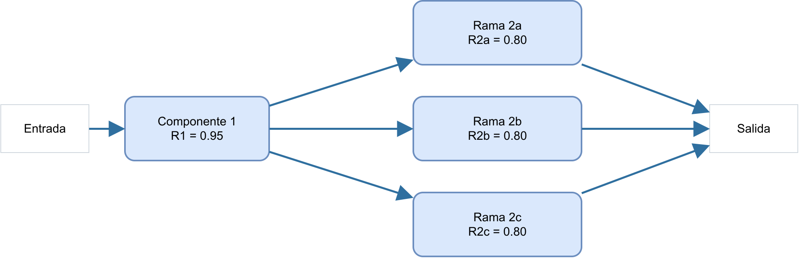

<div class="small">
El bloque 1 es obligatorio y está en serie con el subsistema paralelo formado por 2a, 2b y 2c.
</div>

---

## Sistemas Mixtos

### Ejemplo: serie y paralelo

Componentes: $R_1=0.95$, $R_{2a}=R_{2b}=R_{2c}=0.80$

**Paso 1: Paralelo**

$$
R_{\mathrm{paralelo}}=1-(1-0.80)^3=1-0.20^3=0.992
$$

**Paso 2: Serie total**

$$
R_{\mathrm{sistema}}=0.95\times0.992=0.9424\approx94.2\%
$$

La redundancia protege la función asociada a $2a$, $2b$ y $2c$, pero el componente $1$ continúa siendo obligatorio y limita la confiabilidad total.

---

## Sistemas mixtos: segundo ejemplo

### Serie y paralelo dentro del mismo RBD

Este ejemplo combina una función obligatoria antes y después de una función redundante. El sistema requiere que funcionen $A$ y $C$, además de al menos una de las ramas $B_1$ y $B_2$.

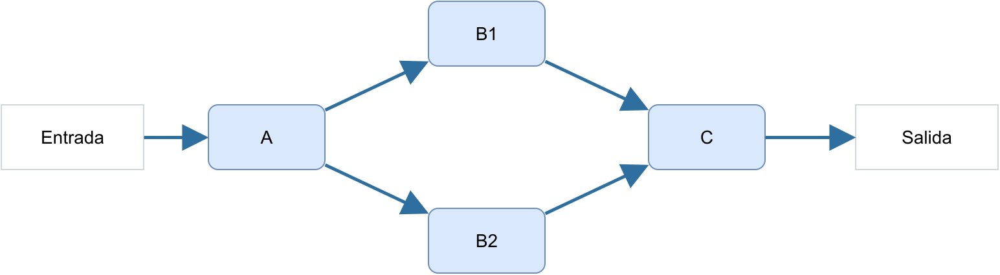

---

## Sistemas mixtos: estrategia de cálculo

### Reducir de adentro hacia afuera

Primero se reduce el bloque paralelo y después se calcula la serie restante.

$$
R_B=1-(1-R_{B_1})(1-R_{B_2})
$$

$$
R_{\mathrm{sistema}}=R_A R_B R_C
$$

<div class="callout">
Reemplazar el paralelo por un bloque equivalente permite aplicar luego la regla de producto de los elementos que quedan en serie.
</div>

---

## Importancia y sensibilidad de los componentes

Una vez calculado $R_{\mathrm{s}}(t)$, podemos preguntar cuánto cambia la confiabilidad del sistema si mejora la confiabilidad de un componente. La **importancia de Birnbaum** se define como:

$$
I_i^B(t)=\frac{\partial R_{\mathrm{s}}(t)}{\partial R_i(t)}
$$

Para derivar esta medida, se toma $R_i(t)$ como variable y se consideran constantes las confiabilidades de los demás bloques.

---

## Importancia de Birnbaum: derivación

En cada arquitectura se separa el factor que contiene $R_i(t)$ y luego se deriva.

### Serie

$$
R_{\mathrm{s}}(t)=R_i(t)\prod_{j\neq i}R_j(t)
\quad\Longrightarrow\quad
I_i^B(t)=\prod_{j\neq i}R_j(t)
$$

### Paralelo

$$
R_{\mathrm{s}}(t)=1-[1-R_i(t)]\prod_{j\neq i}[1-R_j(t)]
$$

Al derivar, el signo del complemento y el de $1-R_i(t)$ se cancelan.

$$
I_i^B(t)=
\frac{\partial}{\partial R_i(t)}
\left\{1-[1-R_i(t)]\prod_{j\neq i}[1-R_j(t)]\right\}
=\prod_{j\neq i}[1-R_j(t)]
$$

---

## Cómo interpretar la importancia

- **Serie:** mejorar el componente $i$ ayuda solo si los demás bloques funcionan. Por eso su importancia es el producto de sus confiabilidades.
- **Paralelo:** mejorar $i$ ayuda cuando fallan todas las demás ramas. Por eso su importancia es el producto de sus probabilidades de falla.

Para comparar alternativas, priorice los componentes con mayor $I_i^B(t)$.

---
<!-- _class: birnbaum-prompt -->

## Ejemplo: Birnbaum para decidir qué mejorar

El sistema tiene un switch $S$ en serie con dos servidores $A$ y $B$ en paralelo.

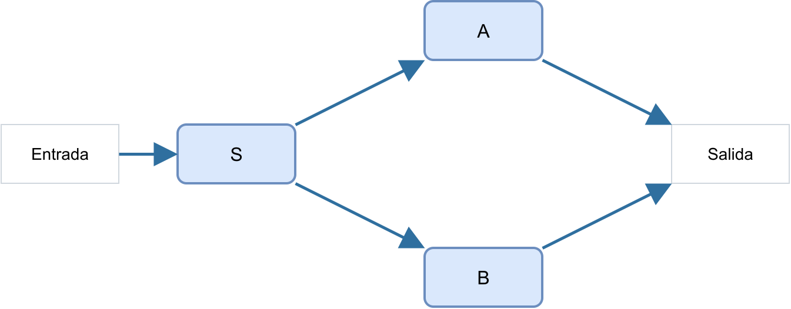

Confiabilidades:

$$
R_S=0.95,\qquad R_A=0.90,\qquad R_B=0.90
$$

1. Calcule $R_s$.
2. Calcule $I_S^B$, $I_A^B$ e $I_B^B$.
3. Decida qué componente conviene mejorar primero.

---

## Solución: importancia del switch $S$

En un sistema mixto no se aplica directamente una fórmula única de serie o paralelo. Se parte de $R_s$ y se deriva respecto de cada $R_i$.

Partimos de:

$$
R_s=R_S\left[1-(1-R_A)(1-R_B)\right]
$$

Derivamos respecto de $R_S$:

$$
I_S^B=\frac{\partial R_s}{\partial R_S}
=1-(1-R_A)(1-R_B)
$$

Con los valores:

$$
I_S^B=1-(0.1)(0.1)=0.99
$$

<div class="callout">
Mejorar el switch afecta a todo el subsistema redundante, porque está presente en todos los caminos de éxito.
</div>

---

## Solución: importancia de los servidores

Para el servidor $A$:

$$
I_A^B=\frac{\partial}{\partial R_A}
\left[R_S\left(1-(1-R_A)(1-R_B)\right)\right]
$$

Luego

$$
I_A^B=R_S(1-R_B)=0.95(0.10)=0.095
$$

<div class="callout">
Mejorar el servidor A solo aporta cuando el switch funciona y la otra rama B falla.
</div>

---

## Solución: importancia de los servidores

Por simetría:

$$
I_B^B=R_S(1-R_A)=0.95(0.10)=0.095
$$

<div class="bridge">
A y B tienen la misma importancia porque ocupan la misma posición estructural y tienen la misma confiabilidad.
</div>

Resultado final:

$$
I_S^B=0.99,\qquad I_A^B=I_B^B=0.095
$$

<div class="warn">
El switch tiene mucho mayor impacto de mejora porque participa en todos los caminos de éxito.
</div>

---

## MTTF de un sistema no reparable

El MTTF del sistema es el tiempo esperado hasta que el sistema deja de cumplir su función.

$$
\mathrm{MTTF}_{\mathrm{s}}=\int_0^\infty R_{\mathrm{s}}(t)\,dt
$$


Primero el RBD entrega $R_{\mathrm{s}}(t)$. Luego el área bajo esa curva entrega el tiempo medio hasta la falla del sistema.

---

## Ejemplo: MTTF desde la confiabilidad del sistema

Suponga que el RBD de un sistema no reparable entrega:

$$
R_{\mathrm{s}}(t)=e^{-0.002t}
$$

Entonces su MTTF es el área bajo esa curva:

$$
\mathrm{MTTF}_{\mathrm{s}}
=\int_0^\infty e^{-0.002t}\,dt
=\frac{1}{0.002}
=500\ \mathrm{h}
$$

La arquitectura ya está incorporada en $R_{\mathrm{s}}(t)$. La integración transforma esa confiabilidad en tiempo esperado.

---

## MTTF del sistema serie: las tasas se acumulan

Si cada componente tiene una distribución exponencial,

$$
R_i(t)=e^{-\lambda_i t}
$$

entonces:

$$
R_{\mathrm{s}}(t)=\prod_i e^{-\lambda_i t}
=e^{-\left(\sum_i\lambda_i\right)t}
$$

$$
\lambda_{\mathrm{s}}=\sum_i\lambda_i,
\qquad
\mathrm{MTTF}_{\mathrm{s}}=\frac{1}{\sum_i\lambda_i}
$$

<div class="bridge">
En serie, cualquiera de los componentes puede terminar la misión. Por eso sus tasas de falla se acumulan.
</div>

---

## MTTF paralelo: dos componentes

Considere dos componentes idénticos, independientes, activos y exponenciales. Cada componente tiene:

$$
R(t)=e^{-\lambda t},
\qquad
F(t)=1-e^{-\lambda t}
$$

Como el sistema paralelo falla solo cuando fallan ambos:

$$
F_{\mathrm{s}}(t)=[1-e^{-\lambda t}]^2
$$

Por complemento y expansión:

$$
R_{\mathrm{s}}(t)=1-[1-e^{-\lambda t}]^2
=2e^{-\lambda t}-e^{-2\lambda t}
$$

---

## MTTF paralelo: dos componentes

Integramos la confiabilidad obtenida desde el RBD:

$$
\mathrm{MTTF}_{\mathrm{s}}
=\int_0^\infty R_{\mathrm{s}}(t)\,dt
=\frac{2}{\lambda}-\frac{1}{2\lambda}
=\frac{3}{2\lambda}
$$

Como $\mathrm{MTTF}_{\mathrm{comp}}=1/\lambda$:

$$
\mathrm{MTTF}_{\mathrm{s}}=1.5\,\mathrm{MTTF}_{\mathrm{comp}}
$$

<div class="callout">
Cada componente sigue teniendo el mismo MTTF individual. El sistema dura más porque puede continuar funcionando después de la primera falla.
</div>

<div class="small">
El MTTF cuantifica tiempo esperado. No reemplaza la confiabilidad requerida para una misión específica.
</div>

---

## MTTF paralelo: verlo por etapas

El mismo resultado se entiende siguiendo el proceso de fallas:

**2 operativos** $\xrightarrow{1/(2\lambda)}$ **1 operativo**

**1 operativo** $\xrightarrow{1/\lambda}$ **0 operativos: falla del sistema**

$$
\mathrm{MTTF}_{\mathrm{s}}
=\frac{1}{2\lambda}+\frac{1}{\lambda}
=\frac{1.5}{\lambda}
$$

<div class="bridge">
El MTTF total es la suma del tiempo esperado que el sistema pasa en cada etapa antes de perder la última rama operativa.
</div>

---

## MTTF paralelo: generalización a $n$ componentes

Si quedan $k$ componentes funcionando, hay $k$ componentes que pueden fallar:

$$
\text{tasa de la pr\'oxima falla}=k\lambda,
\qquad
E[T_k]=\frac{1}{k\lambda}
$$

Sumando las etapas desde $n$ hasta 1 operativo:

$$
\mathrm{MTTF}_{\mathrm{s}}
=\frac{1}{n\lambda}+\frac{1}{(n-1)\lambda}+\cdots+\frac{1}{2\lambda}+\frac{1}{\lambda}
$$

---

## MTTF paralelo: generalización a $n$ componentes

Reordenando la suma:

$$
\mathrm{MTTF}_{\mathrm{s}}
=\frac{1}{\lambda}\left(1+\frac12+\frac13+\cdots+\frac1n\right)
=\frac{H_n}{\lambda},
\qquad
H_n=\sum_{k=1}^{n}\frac1k
$$

Donde $H_n$ representa el $n$-ésimo [número armónico](https://es.wikipedia.org/wiki/N%C3%BAmero_arm%C3%B3nico).

Cada término $1/k$ representa el tiempo relativo que el sistema pasa en la etapa donde quedan $k$ componentes operativos.

---

## Ejemplo: tres componentes en paralelo

Para $n=3$, el MTTF suma las tres etapas:

$$
\mathrm{MTTF}_{\mathrm{s}}
=\frac{1}{3\lambda}+\frac{1}{2\lambda}+\frac{1}{\lambda}
$$

- $1/(3\lambda)$: tiempo medio con 3 componentes.
- $1/(2\lambda)$: tiempo medio con 2 componentes.
- $1/\lambda$: tiempo medio con 1 componente.

$$
H_3=1+\frac12+\frac13\approx1.83,
\qquad
\mathrm{MTTF}_{\mathrm{s}}\approx1.83\,\mathrm{MTTF}_{\mathrm{comp}}
$$

---

<!-- _class: mttf-table -->

## La redundancia mejora el MTTF, con beneficio decreciente

| $n$ | $H_n$ |
|---:|---:|
| 1 | 1.00 |
| 2 | 1.50 |
| 3 | 1.83 |
| 4 | 2.08 |

<div class="callout">
Agregar redundancia aumenta el MTTF, pero cada componente adicional aporta menos que el anterior.
</div>

---

## Sistema $k$ de $n$: una condición de umbral

Un sistema $k$ de $n$ funciona cuando al menos $k$ de sus $n$ componentes están operativos.

<div class="callout">
El sistema no exige componentes específicos. Exige que al menos k de los n estén operativos.
</div>

Los casos límite conectan con lo conocido: $1$ de $n$ es paralelo, $n$ de $n$ es serie y $2$ de $3$ es TMR.

---

## Ejemplo visual: un sistema $3$ de $5$

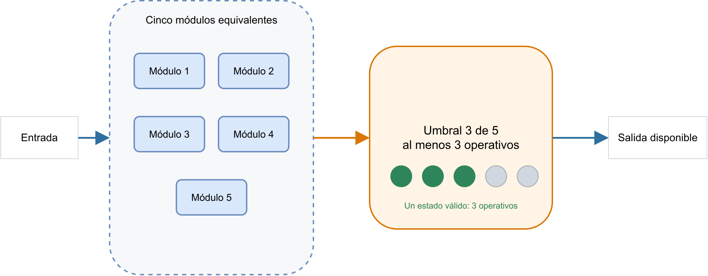

<div class="small">
La salida está disponible si funcionan al menos 3 de los 5 módulos.
</div>

---

## Confiabilidad de un sistema $k$ de $n$

Si los componentes son idénticos e independientes, se suman los escenarios con $k$, $k+1$, hasta $n$ componentes operativos:

$$
R_{k|n}(t)=\sum_{j=k}^{n}\binom{n}{j}[R(t)]^j[1-R(t)]^{n-j}
$$

Cada término cuenta una cantidad posible de componentes que mantiene la función del sistema.

---

## Redundancia modular triple (TMR)

La redundancia modular triple, o TMR, es un sistema $2$ de $3$. Funciona cuando al menos dos módulos entregan el resultado correcto.

El votador compara las tres salidas y entrega la señal que coincide en al menos dos módulos.

<div class="callout">
La TMR sigue funcionando después de una falla porque todavía quedan dos módulos que pueden formar mayoría.
</div>

---

## TMR: tres módulos y un votador

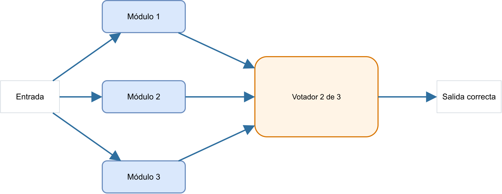

<div class="small">
El votador combina las tres salidas y entrega la señal que coincide en al menos dos módulos.
</div>

---

<!-- _class: tmr-cases-slide -->

## TMR: exactamente dos módulos funcionan

Suponga tres módulos idénticos e independientes, cada uno con confiabilidad $R(t)$.

<div class="tmr-cases">
<div class="tmr-case"><strong>Falla el módulo 1</strong><br>Operan 2 y 3</div>
<div class="tmr-case"><strong>Falla el módulo 2</strong><br>Operan 1 y 3</div>
<div class="tmr-case"><strong>Falla el módulo 3</strong><br>Operan 1 y 2</div>
</div>

Cada caso tiene probabilidad $R(t)^2[1-R(t)]$. Los tres casos son disjuntos.

El factor $3$ aparece porque hay tres formas de elegir cuál módulo falla:

$$
\binom{3}{2}=3
$$

Por lo tanto:

$$
P(\text{exactamente 2 funcionan})=3R(t)^2[1-R(t)]
$$

---

<!-- _class: tmr-sum -->

## TMR: sumar los escenarios de éxito

La TMR funciona si exactamente dos módulos funcionan o si funcionan los tres.

Ya obtuvimos:

$$
P(\text{exactamente 2 funcionan})=3R(t)^2[1-R(t)]
$$

Si funcionan los tres módulos:

$$
P(3\text{ funcionan})=R(t)^3
$$

Como ambos escenarios permiten que la TMR funcione:

$$
R_{2|3}(t)=3R(t)^2[1-R(t)]+R(t)^3
$$

Finalmente:

$$
R_{2|3}(t)=3R(t)^2-2R(t)^3
$$

<div class="callout">
La TMR tolera una falla: puede operar con cualquiera de los tres módulos fallado, y también cuando los tres están correctos.
</div>

---

## TMR: Votador imperfecto

Si el votador tiene confiabilidad $R_v(t)$, también debe funcionar:

$$
R_{\mathrm{TMR}}(t)=R_v(t)[3R(t)^2-2R(t)^3]
$$

<div class="warn">
La redundancia de los módulos no protege frente a la falla del votador.
</div>

---

## TMR: Componentes no idénticos

Ya no existe una única $R(t)$ ni puede utilizarse directamente la fórmula binomial. Se enumeran los mismos escenarios de éxito:

$$
\begin{aligned}
R_{2|3}={}&R_1R_2(1-R_3)+R_1R_3(1-R_2)\\
&+R_2R_3(1-R_1)+R_1R_2R_3
\end{aligned}
$$

---

## Componentes no idénticos: expresión simplificada

Al desarrollar y agrupar los mismos cuatro escenarios:

$$
R_{2|3}=R_1R_2+R_1R_3+R_2R_3-2R_1R_2R_3
$$

La lógica de mayoría se mantiene. Solo cambia la confiabilidad de cada módulo.

---

<!-- _class: rbd-reduction-limit -->

## ¿Siempre podemos reducir un RBD?

Hasta ahora, reducíamos los RBD con bloques equivalentes en serie y paralelo.

Una conexión cruzada puede impedir encontrar un bloque inicial. Necesitamos otra estrategia para calcular $R_s$.

| **Reducible** | **No reducible directamente** |
|---|---|
| serie/paralelo → reducir → reducir → $R_s$ | red con conexión cruzada → ? |

<div class="warn">
La red puente muestra este límite de las reglas de serie y paralelo.
</div>

---

<!-- _class: bridge-example -->

## Ejemplo de red no reducible: red puente

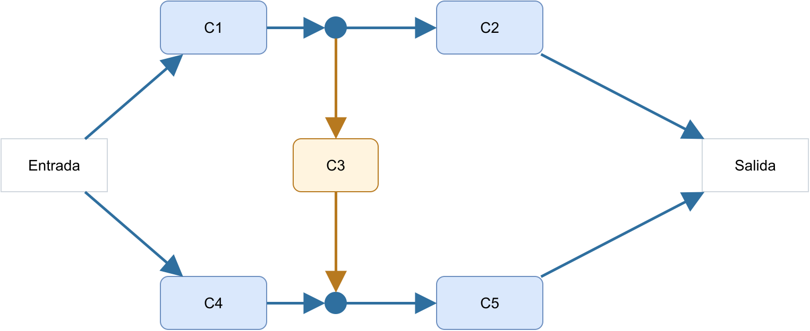

Hay dos trayectorias principales entre entrada y salida. $C_3$ une sus nodos intermedios y crea caminos cruzados.

Ya no hay dos ramas paralelas independientes.

**¿Cómo calculamos $R_s$ si ya no podemos reducir directamente el RBD?**

---

<!-- _class: conditioning-idea -->

## Idea: fijar temporalmente el estado de un componente

Elegimos $C_3$ porque sus estados simplifican la red.

$$
C_3\text{ funciona}
\qquad\text{o}\qquad
C_3\text{ falla}
$$

Los casos son mutuamente excluyentes, exhaustivos y producen RBD más simples.

<div class="callout">
No modificamos la red. Separamos sus estados para calcularlos por separado.
</div>

---

<!-- _class: bridge-case -->

## Si $C_3$ falla: reaparecen serie y paralelo

Si $C_3$ falla, desaparece la conexión central.

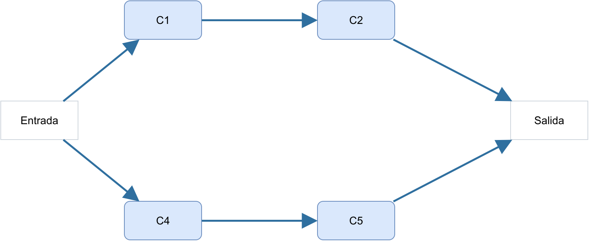

Quedan dos ramas en paralelo:

$$
R_{\text{sup}}=R_1R_2
\qquad
R_{\text{inf}}=R_4R_5
$$

$$
R_{S\mid C_3^c}=1-(1-R_1R_2)(1-R_4R_5)
$$

<div class="callout">
El caso vuelve a ser una combinación de serie y paralelo.
</div>

---

<!-- _class: bridge-case -->

## Si $C_3$ funciona: una conexión perfecta

Si $C_3$ funciona, sus extremos quedan unidos por un camino garantizado. Los nodos centrales son equivalentes.

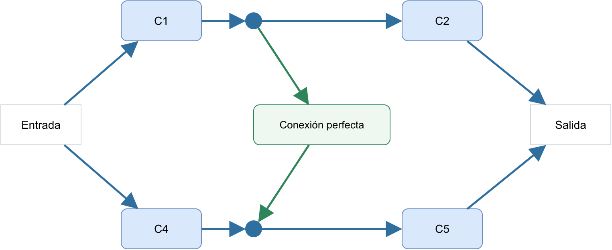

La red queda como:

$$
(C_1\parallel C_4)
\quad\text{en serie con}\quad
(C_2\parallel C_5)
$$

$$
R_{S\mid C_3}
=[1-(1-R_1)(1-R_4)]
[1-(1-R_2)(1-R_5)]
$$

<div class="callout">
Fijar el estado central transforma la red en una estructura reducible.
</div>

---

<!-- _class: conditioning-total -->

## Condicionamiento: combinar los dos casos

Ponderamos cada caso por la probabilidad de su estado de $C_3$:

$$
R_s
=P(C_3)R_{S\mid C_3}
+P(C_3^c)R_{S\mid C_3^c}
$$

Como $P(C_3)=R_3$:

$$
R_s
=R_3R_{S\mid C_3}
+(1-R_3)R_{S\mid C_3^c}
$$

<div class="callout">
Así reutilizamos serie y paralelo en una red que no era reducible directamente.
</div>

---

<!-- _class: tool-transition -->

## Otra forma de describir redes complejas

El condicionamiento permite **calcular** $R_s$. Otra pregunta es qué combinaciones garantizan éxito o falla.

¿Cómo calcular $R_s$? $\longrightarrow$ condicionamiento


¿Qué combinaciones garantizan éxito o falla? $\longrightarrow$ caminos y cortes mínimos

---

<!-- _class: path-min -->

## Camino mínimo: una ruta que garantiza el éxito

Si todos los componentes de un camino mínimo funcionan, existe un camino completo entre entrada y salida.

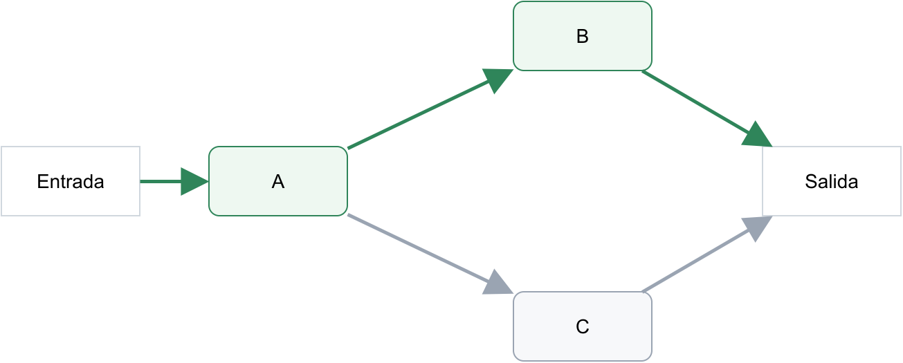

En este ejemplo hay dos caminos mínimos:

$$
\{A,B\}
\qquad
\{A,C\}
$$

$$
\text{Éxito}=(A\cap B)\cup(A\cap C)
$$

<div class="callout">
El sistema funciona si al menos uno de sus caminos mínimos está operativo.
</div>

---

<!-- _class: path-purpose -->

## ¿Para qué sirve un camino mínimo?

- Identificar rutas suficientes para mantener el servicio
- Reconocer redundancia entre trayectorias
- Formular el evento de éxito del sistema

<div class="callout">
Los caminos mínimos responden: <strong>¿qué combinaciones mínimas bastan para que el sistema funcione?</strong>
</div>

---

<!-- _class: cut-min -->

## Corte mínimo: conjuntos que provocan la falla

Un corte mínimo es un conjunto de componentes cuya falla provoca la falla del sistema.

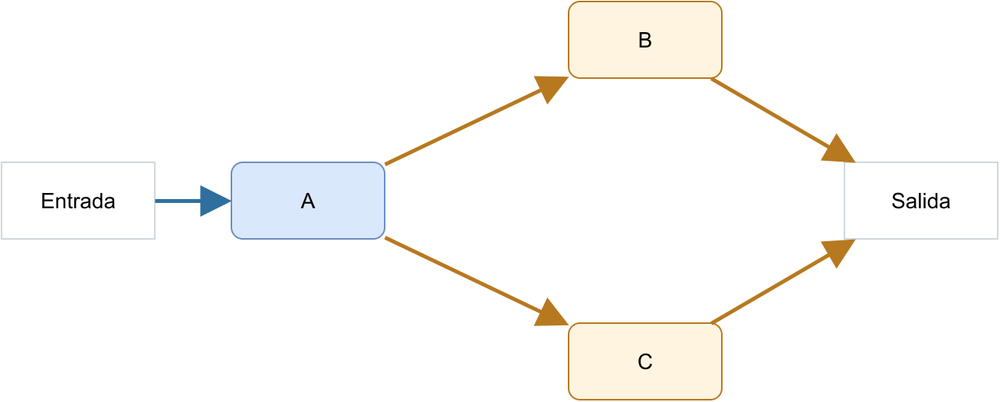

**Corte $\{A\}$:** si falla $A$, se interrumpen todos los caminos hacia la salida.

**Corte $\{B,C\}$:** si fallan simultáneamente $B$ y $C$, también se interrumpen todos los caminos.

$$
\{A\}
\qquad
\{B,C\}
$$

$$
\text{Falla}=A^c\cup(B^c\cap C^c)
$$

<div class="warn">
El sistema falla si ocurre al menos uno de sus cortes mínimos.
</div>

---

## ¿Qué significa "mínimo"?

"Mínimo" significa que no sobra ningún componente dentro del conjunto.

Para $\{B,C\}$:

- si falla solo $B$, el sistema puede seguir por $C$
- si falla solo $C$, el sistema puede seguir por $B$
- cuando fallan ambos, el sistema falla

<div class="warn">
Por eso, este conjunto es mínimo: quitar uno de sus componentes hace que deje de garantizar la falla.
</div>

Puede existir más de un corte mínimo en el mismo sistema.

---

## ¿Para qué sirve un corte mínimo?

- Identificar combinaciones críticas de falla
- Detectar puntos únicos de falla
- Priorizar mejora, mantenimiento o redundancia

<div class="warn">
Los cortes mínimos responden: <strong>¿qué combinaciones mínimas bastan para hacer fallar el sistema?</strong>
</div>

---

<!-- _class: path-cut-compare -->

## Caminos y cortes: dos miradas

| **Caminos mínimos** | **Cortes mínimos** |
|---|---|
| describen éxito | describen falla |
| componentes que deben funcionar | componentes que deben fallar |
| muestran redundancia | muestran vulnerabilidades |

<div class="bridge">
Los caminos muestran cómo sobrevive el sistema. Los cortes muestran cómo puede perderse.
</div>

<div class="warn">
Los cortes mínimos describen fallas suficientes para producir el evento no deseado. Esta lógica se representa naturalmente con un <strong>Fault Tree</strong>.
</div>

---

<!-- diagram-slide: fault-tree-and-or -->

## Árbol de fallas (FT): compuertas Y (AND) / O (OR)

Mientras el RBD busca un camino de éxito, el árbol de fallas parte del evento no deseado y lo descompone en causas. Una compuerta OR basta con una causa. Una AND exige que ocurran todas.

---

<!-- diagram-slide: fault-tree-and-or -->

## Árbol de fallas (FT): compuertas Y (AND) / O (OR)

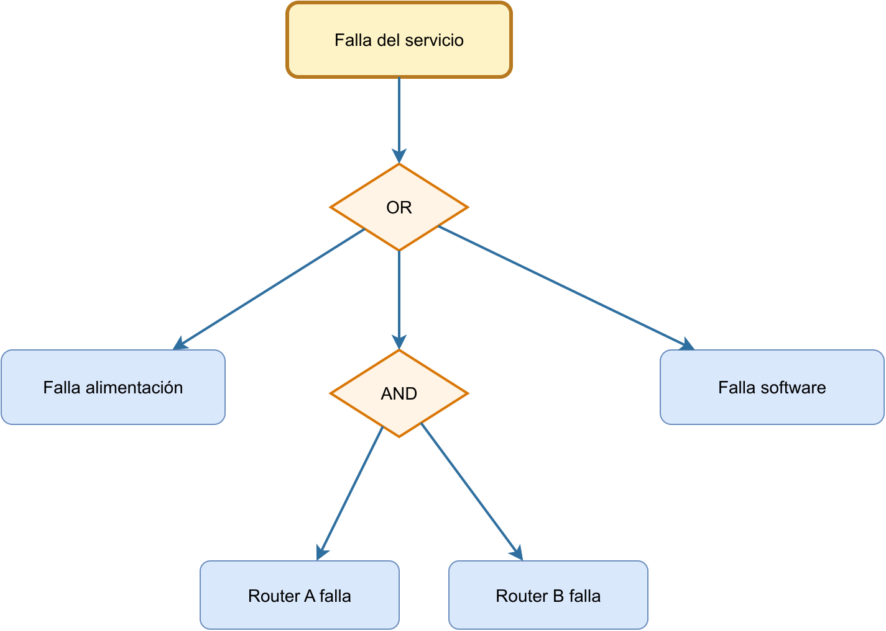

<div class="small">
<strong>Lectura:</strong> FT proviene de <em>Fault Tree</em>. Las compuertas muestran la lógica causal que conduce al evento superior de falla.
</div>

---

<!-- diagram-slide: rbd-vs-ft -->

## RBD frente a FT: misma arquitectura, dos preguntas

Ambos modelos pueden representar la misma arquitectura, pero cambian el punto de partida y la pregunta que se responde.
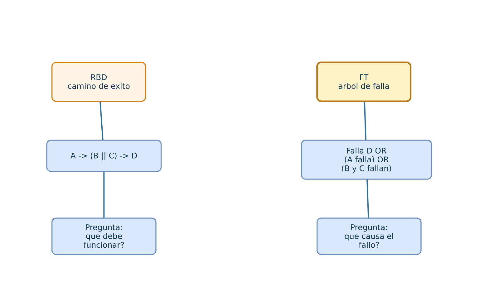

<div class="small">
<strong>Lectura:</strong> RBD pregunta qué debe funcionar. FT pregunta qué combinación de eventos produce la falla. No se debe interpretar la forma geométrica de una compuerta FT como si fuera una conexión física.
</div>

<div class="warn">
Si el mismo componente aparece en más de una rama del árbol, representa un único evento repetido. No debe contarse como si fueran fallas independientes distintas. Su dependencia debe tratarse explícitamente.
</div>

---

## Errores Frecuentes

Antes de aceptar un resultado, revise la lógica funcional, el complemento usado y el supuesto de independencia:

| Síntoma | Causa probable |
|---|---|
| Confundir serie con paralelo en diagrama | No identificar correctamente dependencia lógica |
| Omitir el complemento al calcular la falla de todas las ramas | Tomar el producto de fallas como confiabilidad del paralelo |
| Ignorar dependencia entre componentes | Asumir independencia cuando existen correlaciones |

<div class="warn">
Los RBD describen la lógica estructural del sistema. Las reglas de producto, complemento y reducción de esta clase requieren eventos de funcionamiento independientes. Las correlaciones no consideradas pueden invalidar el cálculo.
</div>

---

## Ejercicio propuesto:

Este ejercicio integra las dos reducciones básicas y una decisión de diseño: mejorar una rama redundante o eliminar un punto único de falla.

Dado un sistema con:
- dos servidores independientes en paralelo, cada uno con $R=0.95$
- un switch independiente en serie con $R_{\mathrm{sw}}=0.98$.

**Preguntas:**
1. Dibuje el RBD del sistema
2. Calcule la confiabilidad total
3. Compare aumentar el switch a $0.99$ con aumentar cada servidor a $0.96$.

<div class="example-space">
Espacio para desarrollar cálculos y discutir prioridades de mejora en diseño.
</div>

---

## Solución del ejercicio

Confiabilidad del bloque de servidores:

$$
R_{\mathrm{srv}}=1-(1-0.95)^2=0.9975
$$

Sistema original:

$$
R_{\mathrm{s}}=0.98(0.9975)=0.97755
$$

Alternativas:

$$
R_{\mathrm{s}}^{(\mathrm{sw})}=0.99(0.9975)=0.987525
$$

$$
R_{\mathrm{s}}^{(\mathrm{srv})}=0.98[1-(1-0.96)^2]=0.978432
$$

Los incrementos son $\Delta R_{\mathrm{sw}}=0.987525-0.97755=0.009975$ y $\Delta R_{\mathrm{srv}}=0.978432-0.97755=0.000882$.

Mejorar el switch produce mayor beneficio porque participa obligatoriamente en toda trayectoria de éxito. La mejora adicional de una rama ya redundante tiene menor impacto marginal.

---

<!-- sequence-bridge -->

## Continuidad: de estructura a estados

- RBD y FT representan combinaciones estáticas de éxito o falla para una misión o instante dado.
- No describen de forma natural el orden de fallas, reparaciones ni estados degradados.
- Cuando la pregunta pasa de "qué estructura permite operar" a "cómo cambia el sistema en el tiempo", se requiere un modelo de estados.
- La siguiente unidad introduce procesos estocásticos y cadenas de Markov en tiempo discreto (DTMC) para representar esa evolución.

<div class="bridge">
Los RBD responden "qué componentes deben funcionar". Las cadenas de Markov conservan esa lógica funcional, pero agregan "cómo cambia el sistema entre estados".
</div>

---

## Cierre

Al terminar esta clase:

- Comprende la estructura básica de un **RBD**
- Puede calcular confiabilidad para sistemas **serie**, **paralelo** y **mixtos**
- Entiende el valor de la **redundancia** en diseño
- Sabe identificar cuándo una red exige condicionamiento o un análisis de fallas común

<div class="callout">
Los RBD transforman confiabilidades individuales en confiabilidad de sistema. La clave es traducir correctamente la función requerida, la arquitectura y sus supuestos antes de calcular.
</div>

---

## Referencias

- K. S. Trivedi y A. Bobbio, *Reliability and Availability Engineering: Modeling, Analysis, and Applications*, Cambridge University Press, 2017, caps. 4 y 6.
- K. S. Trivedi, *Probability and Statistics with Reliability, Queuing, and Computer Science Applications*, 2.ª ed., Wiley, 2002, cap. 4.
- [Número armónico](https://es.wikipedia.org/wiki/N%C3%BAmero_arm%C3%B3nico), Wikipedia en español.
- J. M. Martínez, *TEL211: Reliability Block Diagrams*, material histórico USM.
